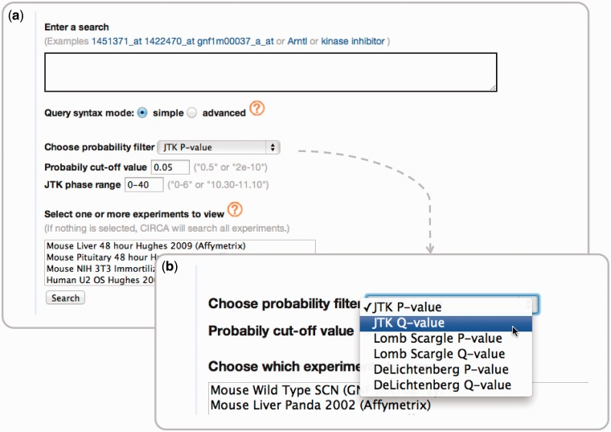
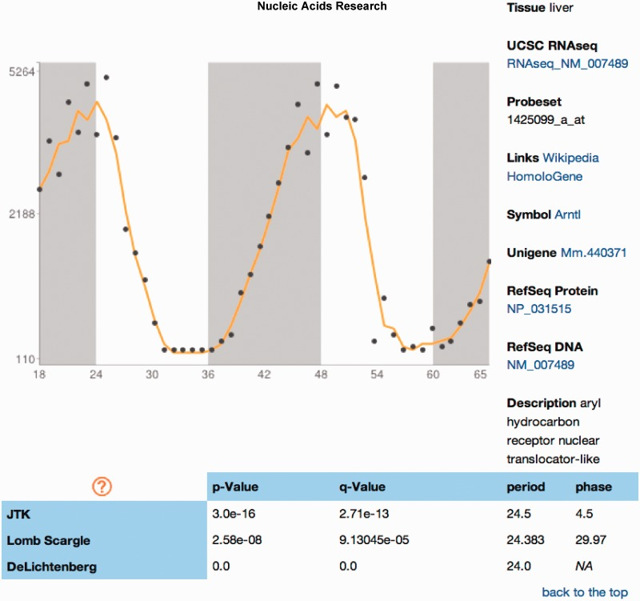

<a class="site-title" href="index.html">Hogenesch Lab</a>
<nav class="site-nav" aria-label="Primary">
  <a href="index.html">Home</a>
  <a href="research.html">Research</a>
  <a href="people.html">People</a>
  <a href="collaborations.html">Collaborations</a>
  <a href="publications.html">Publications</a>
  <a class="active" href="resources.html">Resources</a>
  <a href="join.html">Join</a>
</nav>

<header class="page-header">
  
Featured Resource

  <h1>CircaDB</h1>
  

    CircaDB is a searchable database of mammalian circadian gene-expression profiles built to
    make published rhythmic datasets accessible by gene, tissue, phase, and supporting
    statistics.
  

</header>

<h2>Visit CircaDB</h2>

<a href="https://circadb.hogeneschlab.org/">Open the live database at circadb.hogeneschlab.org</a>.

<a href="https://pubmed.ncbi.nlm.nih.gov/23180795/">Publication</a> &#8226; <a href="resources.html">Resources</a>

## What the Database Provides

- Searchable rhythmic expression profiles across public mammalian datasets.
- Gene-centric views that combine annotation, rhythmicity statistics, and expression traces.
- A practical bridge between published circadian datasets and day-to-day biological questions.

## Interface Preview

<figure class="feature-figure">

<figcaption>Query interface for moving from a gene or probe to datasets, phase filters, and circadian statistics.</figcaption>

Pizarro et al., <em>Nucleic Acids Research</em> 2013. Open-access figure (CC BY-NC 3.0).

</figure>
<figure class="feature-figure">

<figcaption>Expression-profile report view combining annotations, algorithm outputs, and compact rhythmic expression traces.</figcaption>

Pizarro et al., <em>Nucleic Acids Research</em> 2013. Open-access figure (CC BY-NC 3.0).

</figure>

## Why It Matters

CircaDB helped make circadian transcriptomics easier to explore outside specialized analysis
pipelines. It remains one of the lab's clearest examples of building reusable public
infrastructure for rhythmic biology.

<footer class="page-footer">

CircaDB is one part of a broader lab portfolio of public resources, algorithms, and circadian datasets.

</footer>
