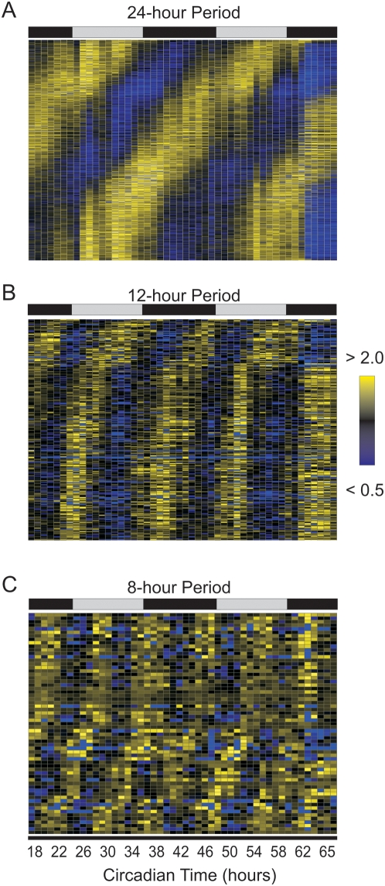
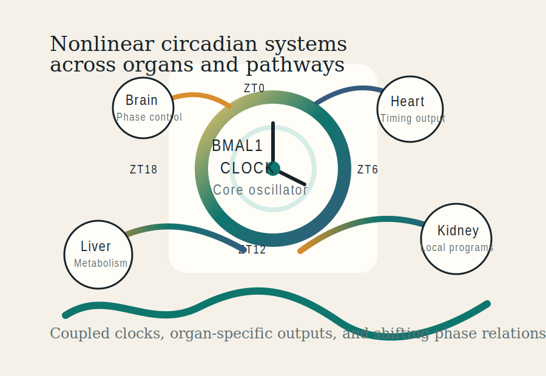

<nav class="site-nav">
  <a class="brand" href="index.html">Hogenesch Lab</a>
  <a href="research.html">Research</a>
  <a href="people.html">People</a>
  <a href="publications.html">Publications</a>
  <a href="resources.html">Resources</a>
  <a href="join.html">Join</a>
</nav>

<header class="hero">
  
Published contributions in circadian biology, genomics, and medicine

  <h1>Hogenesch Lab</h1>
  

    The lab is known for foundational work on the mammalian circadian clock, genome-scale
    analysis of rhythmic transcription, and widely used computational tools and public
    resources for rhythmic biology.
  

</header>

<section class="hero-affiliations">

Institutional Affiliations

</section>

<figure class="hero-visual">

<figcaption>Rhythmic and sub-circadian transcriptional structure from published lab work on harmonic organization in mammalian gene expression.</figcaption>

From Hughes et al., <em>PLOS Genetics</em> 2009. Open-access figure (CC BY).

</figure>
<figure class="hero-visual">

<figcaption>Systems chronobiology as coupled clocks, organ-specific outputs, and nonlinear phase relationships across the body.</figcaption>

Original schematic informed by published work on the multi-organ circadian atlas and systems circadian biology.

</figure>
<figure class="hero-visual">

<figcaption>CircaDB translated rhythmic expression data into a usable public database for bench and computational investigators.</figcaption>

From Pizarro et al., <em>Nucleic Acids Research</em> 2013. Open-access figure (CC BY-NC 3.0).

</figure>

## Overview

The Hogenesch Lab studies how the circadian clock organizes transcription and physiology
across cells, tissues, and organisms. The lab's most visible contributions include discovery
and characterization of BMAL1 and related clock components, functional genomics of circadian
transcription, the mammalian circadian transcriptome, the circadian gene expression atlas
across mouse organs, and public tools and databases used throughout the field.

Representative public resources include JTK_CYCLE, PSEA, MetaCycle, CYCLOPS, and CircaDB.
The lab has also contributed to human circadian transcriptomics and broader discussions of
circadian medicine and chronotherapy through public datasets and published analyses.

## Research Themes

<h2>Molecular Mechanisms of the Circadian Clock</h2>

Core clock components, transcriptional feedback structure, and molecular regulation of rhythmic physiology.

<h2>Systems Circadian Biology and Genome-Scale Datasets</h2>

Transcriptome-wide analyses, organ-level atlases, and large public datasets defining rhythmic transcription.

<h2>Computational Tools for Rhythmic Biology</h2>

Statistical and computational methods including JTK_CYCLE, PSEA, MetaCycle, and CYCLOPS.

<h2>Circadian Medicine and Chronotherapy</h2>

Published work linking timing biology to human transcriptomics, physiology, and therapeutic timing.

## Selected Impact Areas

- Discovery and characterization of BMAL1 and related mammalian clock components.
- Functional genomics approaches that defined regulators and outputs of the clock.
- The mammalian circadian transcriptome and the mouse multi-organ circadian atlas.
- Public databases and methods that remain widely used in rhythmic biology.

## Quick Paths

<a class="card-link" href="research.html">
<strong>Research</strong>
Clock mechanisms, systems chronobiology, and human translation.
</a>
<a class="card-link" href="publications.html">
<strong>Selected Publications</strong>
Key papers plus direct links to the full publication list on Google Scholar and PubMed.
</a>
<a class="card-link" href="resources.html">
<strong>Software and Data</strong>
JTK_CYCLE, PSEA, MetaCycle, CYCLOPS, CircaDB, and the circadian atlas.
</a>
<a class="card-link" href="circadb.html">
<strong>CircaDB</strong>
Database overview, paper links, and a direct route to circadb.hogeneschlab.org.
</a>
<a class="card-link" href="people.html">
<strong>People</strong>
Leadership, lab structure, and selected trainees and alumni.
</a>
<a class="card-link" href="join.html">
<strong>Join</strong>
Opportunities for experimental, computational, and clinician-scientist trainees.
</a>

<footer class="page-footer">

Minimal static site for long-term maintenance and GitHub Pages deployment.

</footer>
