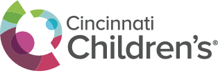
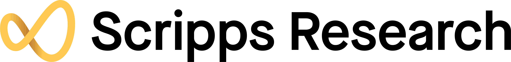

<nav class="site-nav">
  <a class="brand" href="index.html">Hogenesch Lab</a>
  <a href="research.html">Research</a>
  <a href="people.html">People</a>
  <a href="publications.html">Publications</a>
  <a href="resources.html">Resources</a>
  <a class="active" href="join.html">Join</a>
</nav>

<header class="page-header">
  
Join

  <h1>Work on biological time with experimental and computational depth</h1>
  

    The lab is a strong fit for people who want to move between mechanism, datasets,
    and translational questions without treating those as separate worlds.
  

</header>

## Who Fits Well

- Experimental biologists interested in circadian mechanisms, physiology, and disease.
- Computational scientists working on transcriptomics, machine learning, and rhythm analysis.
- Clinician-scientists interested in sleep, circadian medicine, chronotherapy, or human time-of-day effects.
- Trainees who value shared tools, reproducible analysis, and cross-disciplinary collaboration.

## What to Send

Prospective trainees and collaborators should include:

- A short note describing scientific interests.
- A current CV.
- Links to papers, code, datasets, or other representative work when relevant.

## Contact

For scientific inquiries, collaboration discussions, or trainee interest, contact
<a href="mailto:john.hogenesch@cchmc.org">john.hogenesch@cchmc.org</a>.

  
  

<footer class="page-footer">
  
See <a href="research.html">Research</a> for current scientific directions and <a href="resources.html">Resources</a> for lab-built tools.

</footer>
