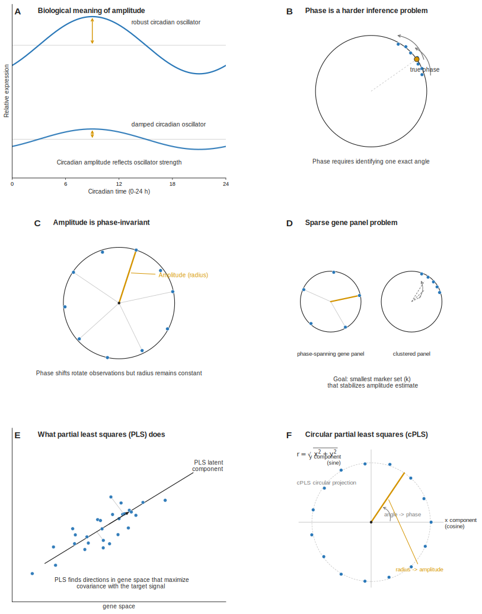

<nav class="site-nav">
  <a class="brand" href="index.html">Hogenesch Lab</a>
  <a class="active" href="research.html">Research</a>
  <a href="people.html">People</a>
  <a href="publications.html">Publications</a>
  <a href="resources.html">Resources</a>
  <a href="join.html">Join</a>
</nav>

<header class="page-header">
  
Research

  <h1>From clock mechanism to clinical timing</h1>
  

    The lab's program links core circadian biology to genome-scale physiology and
    translational questions in humans.
  

</header>

## Circadian Biology

The lab has long focused on the molecular logic of the mammalian clock: how core factors
form oscillators, how light and environment reset those oscillators, and how timing
information is transmitted into physiology. This work includes contributions to BMAL1/MOP3,
ROR-driven regulation of clock output, CHRONO, and broad efforts to map clock function in
mammalian tissues.

Key themes:

- Core clock components and feedback structure.
- Tissue-specific clock architecture across organs.
- Molecular coupling between environment, metabolism, and timing.

## Systems Genomics

Circadian phenotypes are distributed across genes, pathways, and tissues, so the lab uses
functional genomics and computational analysis at scale. This includes transcriptome atlases,
high-throughput perturbation strategies, and methods that recover rhythmic structure from
complex datasets.

Representative capabilities:

- Genome-wide perturbation screens for clock modifiers.
- High-resolution time-series transcriptomics in model systems.
- Cross-tissue and cross-species comparison of rhythmic gene expression.
- Machine-learning and statistical methods for periodicity detection and sample ordering.

## Circadian Medicine

The translational aim is straightforward: if physiology changes across the day, medicine
should account for time. The lab studies human timing biomarkers, disease-linked clock
disruption, and tissue-specific rhythms that may help determine when to measure, intervene,
or dose.

Active translational directions reflected in local lab materials include:

- Human skin rhythms and epidermal biomarkers of molecular clock phase.
- Population-level transcriptomic reconstruction with unordered human samples.
- Clock biology in sleep, metabolism, pulmonary biology, immunology, and cancer-related pathways.
- Community resources that make circadian data usable by experimental and clinical investigators.

## Representative Contributions

  

    <h2>Discovery</h2>
    
Foundational work on BMAL1/MOP3 and the positive limb of the mammalian clock.

  

  

    <h2>Functional Genomics</h2>
    
Genome-wide RNAi and expression profiling approaches to reveal clock components and outputs.

  

  

    <h2>Community Tools</h2>
    
Algorithms and databases built so the broader field can analyze rhythmic biology at scale.

  

  

    <h2>Human Translation</h2>
    
Methods that recover timing information from human tissues and motivate circadian medicine.

  

<footer class="page-footer">
  
See <a href="publications.html">selected publications</a> and <a href="resources.html">resources</a> for representative papers and tools.

</footer>
